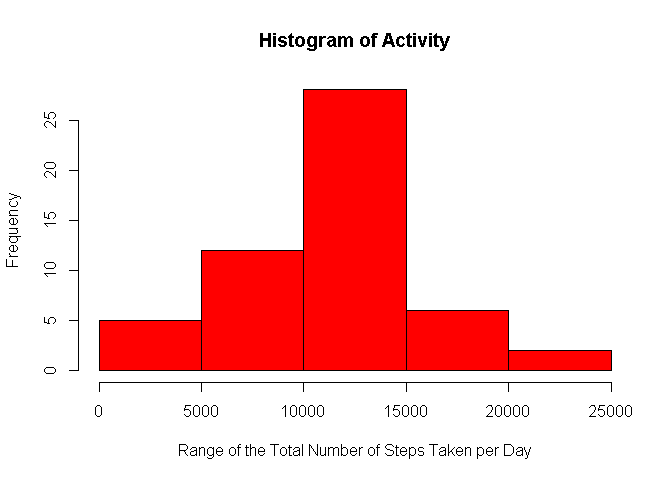
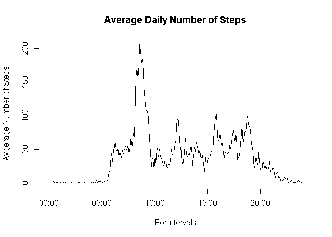
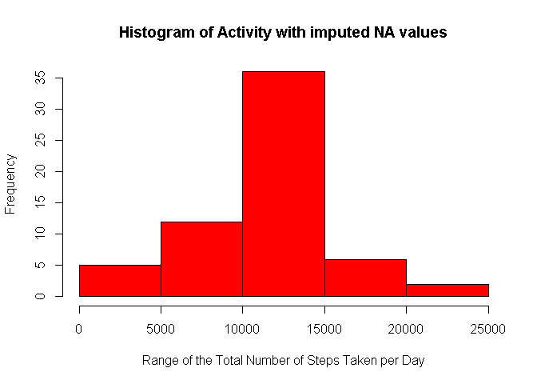
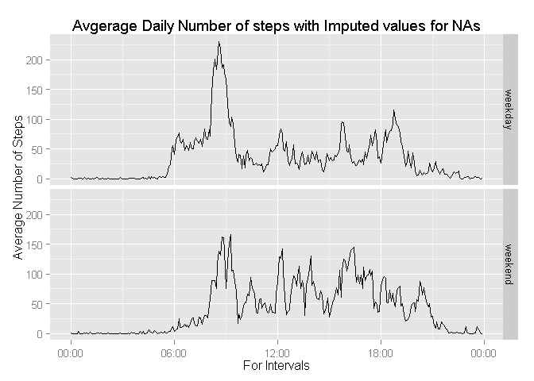

# Reproducible Research: Peer Assessment 1

## Establish the environment.

If required packages are not installed, install the require packages and load libraries


```r
if("dplyr" %in% rownames(installed.packages()) == FALSE) 
{install.packages("dplyr")}
library(dplyr)

if("lubridate" %in% rownames(installed.packages()) == FALSE) 
{install.packages("lubridate")}
library(lubridate)

if("ggplot2" %in% rownames(installed.packages()) == FALSE) 
{install.packages("ggplot2")}
library(ggplot2)

if("scales" %in% rownames(installed.packages()) == FALSE) 
{install.packages("scales")}
library(scales)
```

## Loading and preprocessing the data

Set the working directory and the location of the Activity data.


```r
setwd("~/GitHub/RepData_PeerAssessment1/")
```

Unzip the required data 


```r
unzip("activity.zip")
```

Read the Activity Data into a data frame,  modify date to be a POSIXct date and the interval to reflect HH:MMs.

Removed the 8 days of activity where there are only NA's, modifying the histogram, means and median for the inital evaluation. Lowering the frequency counts between 0 - 5000 and elevating the means and median numbers. There are several discussion forum post addressing this issue.


```r
Activity<-read.csv("activity.csv")
Activity$date<-ymd(Activity$date)
Activity$interval<-formatC(Activity$interval, width = 4, format = "d", flag = "0")
Activity$interval<-paste(substr(Activity$interval,1,2), 
                                       substr(Activity$interval,3,4), sep=":")
ActivityNoNAs<-filter(Activity, steps>=0)
```

## Processing of Activity Data with NA's

### What is mean total number of steps taken per day?

Calculate the total number of steps taken per day.


```r
ActivityByDateSum <- summarise(group_by(ActivityNoNAs, date), stepSum=sum(steps, 
    na.rm = TRUE))
```

Generate a Histogram of the Total Number of Steps Each Day.


```r
hist(ActivityByDateSum$stepSum,
     xlab= "Range of the Total Number of Steps Taken per Day", col ="red",
     main = "Histogram of Activity")
```

 

Calculate and report the mean and median of the total number of steps taken per day


```r
dailystepsmean<-formatC(mean(ActivityByDateSum$stepSum), digits=2, format ="f")
dailystepsmedian<-formatC(median(ActivityByDateSum$stepSum), digits=2, format ="f")
```


Mean of the total number of steps taken per day = 10766.19.

Median of the total number of steps taken per day = 10765.00.


### What is the average daily activity pattern?

Summarize the activity data at 5 minute intervals over 24 hours.


```r
ActivityByIntervalMean <- summarise(group_by(ActivityNoNAs, interval), 
                                    mean(steps, na.rm = TRUE))
ActivityByIntervalMean$DateTime<-as.POSIXlt(paste(Sys.Date(), ActivityByIntervalMean$interval), "%Y-%m-%d %H:%M", tz="")
```

Generate a plot showing the average daily activity. 

While the sample plot, for this assessment, shows several occurrences of relatively straight lines for some transition periods between intervals (one for every hour of the 24 hour period), using a POSIXct variable for the interval eliminates these. Please see the discussion in the forums for background on this issue.  https://class.coursera.org/repdata-012/forum/thread?thread_id=36


```r
plot(ActivityByIntervalMean$DateTime, ActivityByIntervalMean$mean, type="l", 
     xlab="For Intervals", ylab="Avgerage Number of Steps", 
     main="Average Daily Number of Steps")
```

 

Calculate and report the 5 Minute interval having maximum average  number of steps.


```r
maxinterval<-as.character(ActivityByIntervalMean[which.max(ActivityByIntervalMean$mean), 1])
maxmean<-round(max(ActivityByIntervalMean$mean), 2)
```

08:35 is the 5 Minute interval having the maximum average number of steps equaling 206.17 


## Processing of Activity Data with imputed values for NA's

### Imputing missing values

Calculate and report the total missing values in the dataset (total number of rows with NA's)


```r
misVal<-Activity[!complete.cases(Activity),]
maxnrow<-nrow(misVal) 
```

There are 2304 rows with missing values.


Create a new dataset equal to the original dataset with the missing data filled in, using the Average number of steps per interval, as calculated above, to complete the data at 5 minute intervals.


```r
ActivityWoNAs<-Activity
misVal$iRow<-as.integer(substr(misVal$interval,1,2))*12+
    (as.integer(substr(misVal$interval,4,5))/5+1)
for (i in 1:nrow(misVal)) {
    ActivityWoNAs[rownames(misVal[i,]), 1]<- ActivityByIntervalMean[misVal[i,4],2]
}
```

Summarize the steps taken per day with imputed values for NA's.


```r
ActivityWoNAsByDateSum <- summarise(group_by(ActivityWoNAs, date), stepSum=sum(steps))
```

Generate a Histogram of the Total Number of Steps Each Day with imputed values for NA's.


```r
hist(ActivityWoNAsByDateSum$stepSum,
     xlab= "Range of the Total Number of Steps Taken per Day", col ="red",
     main = "Histogram of Activity with imputed NA values")
```

 

Calculate and report the mean and median of the total number of steps taken per day including imputed NA values.


```r
dailystepsmeanimputednas<-formatC(mean(ActivityWoNAsByDateSum$stepSum), digits=2, format ="f")
dailystepsmedianimputednas<-formatC(median(ActivityWoNAsByDateSum$stepSum), digits=2, format ="f")
```

Mean of the total number of steps taken per day = 10766.19 with imputed values for NAs.

Median of the total number of steps taken per day = 10766.19 with imputed values for NAs.


## Are there differences in activity patterns between weekdays and weekends?

Summarize the activity data by weekday versus weekend days at 5 minute intervals over 24 hours.


```r
ActivityWoNAs$DayOfWeekInd<-factor(mapply(function(x) 
        if (substr(weekdays(x), 1,1) == "S") {return("weekend")} 
        else {return ("weekday")}, ActivityWoNAs$date))
ActivityByIntervalMeanWoNAs <- summarise(group_by(ActivityWoNAs, DayOfWeekInd, interval), 
        stepmeans=mean(steps))
ActivityByIntervalMeanWoNAs$DateTime<-as.POSIXct(paste(Sys.Date(), 
        ActivityByIntervalMeanWoNAs$interval), "%Y-%m-%d %H:%M", tz="")
```

Generate a plot showing the average daily activity comparing weekdays versus weekend days.

While the sample plot for intervals shows several occurrences of relatively straight lines for some transition periods between intervals (one for every hour of the 24 hour period) using a POSIXct variable for the interval eliminates these. Please see the discussion in the forums for background on this issue.  https://class.coursera.org/repdata-012/forum/thread?thread_id=36


```r
g<-ggplot(data = ActivityByIntervalMeanWoNAs, aes(DateTime, stepmeans))
p<-g +  facet_grid(DayOfWeekInd ~.) + 
    geom_line(aes(group=1)) +  
    labs(title = "Avgerage Daily Number of steps with Imputed values for NAs") +
    labs(x= "For Intervals", y="Average Number of Steps") +
    scale_x_datetime(labels = date_format("%H:%M"))

print(p)
```

 

